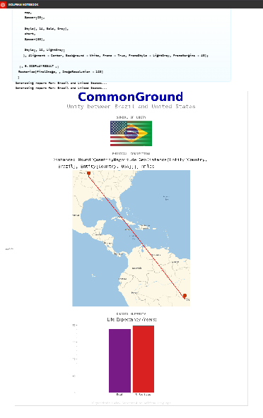

# CommonGround
- https://www.wolframcloud.com/obj/venelouis/Published/CommonGround.nb
- https://devpost.com/software/commonground-61j8sd

## CommonGround: Algorithmic Unity
This is a Wolfram Language application designed to be deployed to the Wolfram Cloud. CommonGround is a web application built on the Wolfram Cloud designed to algorithmically dismantle the psychological barriers of borders. By taking any two nations as input, it generates a dynamic "Unity Report" that visualizes our shared humanity. The concept is simple but powerful: It takes two different nations (representing two users from different backgrounds) and algorithmically generates a "Unity Report." This report visualizes the connections between them—blending their flags, finding their shared languages, comparing their human statistics to show equality, and mapping the geodesic connection between them.
## Inspiration
In a digital age where algorithms are often accused of creating echo chambers and polarization, I wanted to flip the script. I asked myself: Can we write code that mathematically proves our connection?
The hackathon prompt called for "unity," and I realized that while borders are political constructs, humanity is a shared constant. I was inspired by the idea of the "Overview Effect"—the cognitive shift astronauts experience when viewing the Earth from space, seeing a planet without borders. I wanted to create a digital version of that experience, using data to build bridges instead of walls.
## What it does
CommonGround is a web application that takes any two nations as input and generates a "Unity Report." Instead of comparing countries to see who is "better" (GDP rankings, military size), it looks for intersections.
- Flag Fusion: It algorithmically blends the national flags of the two selected countries into a single, unified banner, symbolizing the merging of identities.
- The Geodesic Bridge: It renders a dynamic map showing the shortest path between the two nations, visualizing the physical link between peoples.
- Shared Humanity: It visualizes life expectancy data side-by-side, highlighting that regardless of geography, the human drive for a long, healthy life is universal.
- Language Connector: It automatically detects and lists any shared spoken languages to highlight cultural bridges.

## How I built it
I built CommonGround using the Wolfram Language and the Wolfram Knowledgebase. The power of Wolfram allowed us to access curated data about every country on Earth without needing external APIs or databases.
1. The Flag Fusion Algorithm: I treated the flags not just as images, but as matrices of pixel data. To create a seamless transition between two flags, $F_1$ and $F_2$, I constructed a linear gradient mask, $M$. The final image $I_{unity}$ is calculated as:$$I_{unity} = (F_1 \times M) + (F_2 \times (1 - M))$$ I used ImageResize to normalize aspect ratios and LinearGradientImage to generate the alpha mask $M$.
2. Knowledge Retrieval I utilized the EntityValue function to pull real-time data.EntityValue[CountryData, "Languages"]
This allowed me to instantly find the intersection of sets between two nations:$$ S_{shared} = L_{countryA} \cap L_{countryB} $$
3. Cloud DeploymentInstead of setting up complex servers, I used CloudDeploy and FormPage to instantly wrap our Wolfram code into a public-facing HTML5 web app.

## Challenges I ran into
- Data Heterogeneity: Not all countries have the same depth of data in the Knowledgebase. Handling Missing[] values for smaller nations without breaking the application required careful error checking.
- Image Aspect Ratios: National flags come in wildly different shapes (e.g., Nepal's non-rectangular flag vs. the standard rectangular ones). I had to write normalization logic to ensure the "fusion" didn't distort the symbols disrespectfully.
- Color Spaces: Blending flags required ensuring both images were in the same color space and had alpha channels removed before applying the gradient mask.

## Accomplishments that I'm proud of
I am most proud of the "Flag Fusion" visual. It’s a simple image processing trick, but the result is emotionally resonant. Seeing the Stars and Stripes blend seamlessly into the Union Jack or the Hinomaru is a powerful visual metaphor for cooperation.
I am also proud of the efficiency of our code. The entire backend, frontend, data retrieval, and image processing logic is contained in less than 100 lines of Wolfram Language code.

## What I learned
I learned that symbolism can be algorithmic. I often think of "art" and "math" as separate disciplines, but using vector math to blend cultural symbols showed us that code can be a medium for emotional expression. I also gained a deeper appreciation for the Wolfram Knowledgebase's ability to connect distinct data points (geography, linguistics, and vexillology) in a single query.

## What's next for CommonGround
- Musical Unity: I want to use EntityValue to pull "National Anthems" and algorithmically mash them up into a single audio track.
- 3D Globe Visualization: Upgrading the 2D map to an interactive 3D globe that users can spin to see the connection path.
- Social Sharing: Generating a downloadable "Unity Card" that users can share on social media to spread the message of connection.

## The Concept
In a world often divided by borders and politics, CommonGround is a Wolfram Language application designed to remind us of our shared humanity.
The app takes two inputs—two different countries—and generates a "Unity Report". It visualizes that no matter how far apart two nations are geographically, they are connected by shared human statistics, potentially shared languages, and a physical geodesic path.

## Features
Flag Fusion Algorithm:
Using image processing (ImageAdd, LinearGradientImage), the app takes the flags of the two selected nations and blends them into a single, unified banner. This serves as a visual metaphor that cultures can coexist and create something beautiful together.

## The Geodesic Bridge:
It renders a GeoGraphics map showing the direct curve connecting the two locations, symbolizing that there are no walls high enough to stop the connection between two points on Earth.

## Data Humanization:
It pulls real-time data via EntityValue (e.g., Life Expectancy) to show that the basic human condition—the desire for a long life—is consistent across borders.

# How to Run
Option 1: Wolfram Cloud (Recommended)
1. Log in to the Wolfram Cloud.
2. Create a new Notebook.
3. Paste the code from unity_app.wl into a cell.
4. Press Shift + Enter.
5. Click the link generated in the output (e.g., CloudObject[...]).
6. Share the link with anyone!

Option 2: Wolfram Desktop / Mathematica
1. Open Mathematica.
2. Paste the code into a script.
3. Run it. It will deploy the form to your associated cloud account and return a URL.

## Technical Stack
- Language: Wolfram Language (v13+)
- Key Functions: CloudDeploy, FormPage, GeoGraphics, EntityValue, ImageMultiply, BarChart.
- Data Sources: Wolfram Knowledgebase (Curated Country Data).
